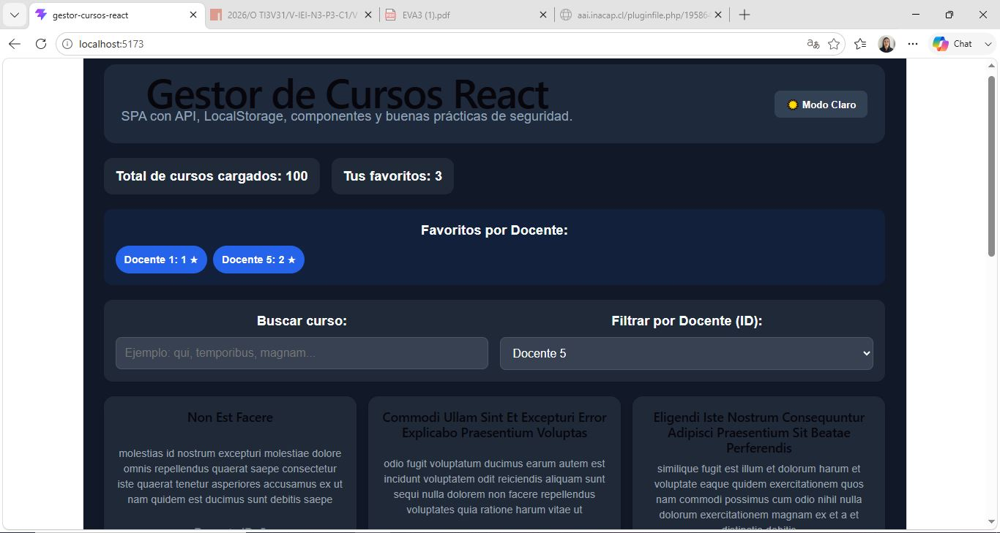

# Evaluacion 3: Gestor de Cursos

Aplicación web SPA desarrollada en React (Vite) que consume una API externa, gestiona favoritos de forma persistente y aplica buenas prácticas de seguridad frontend.

# Enlace al Repositorio
https://github.com/scarletpaez-2001/Gestor_de_cursos_API.git

